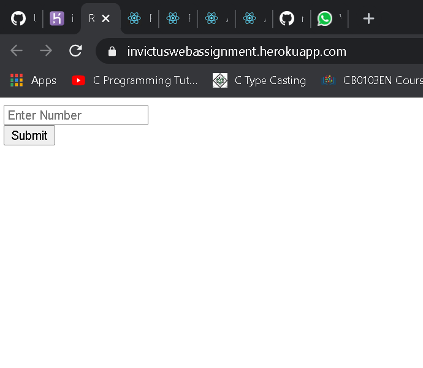
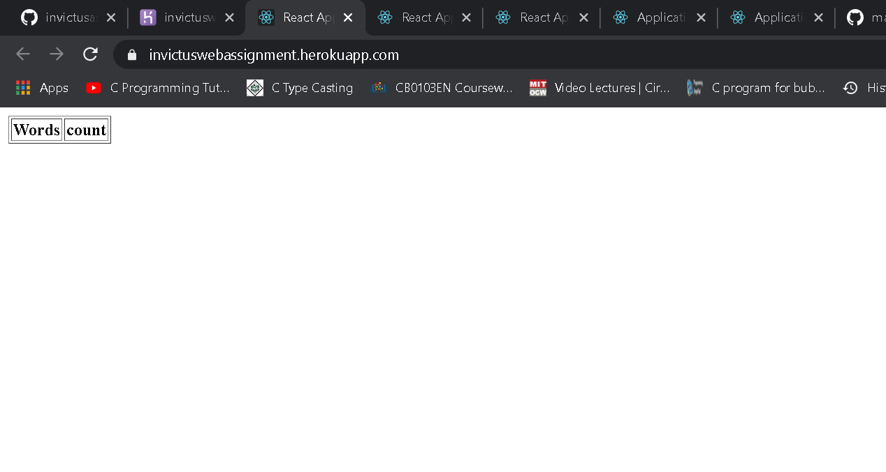
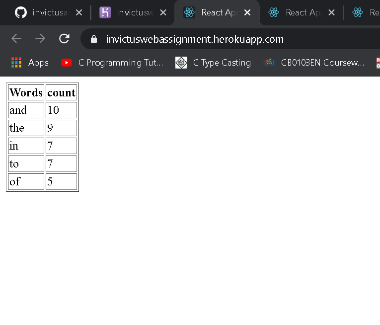
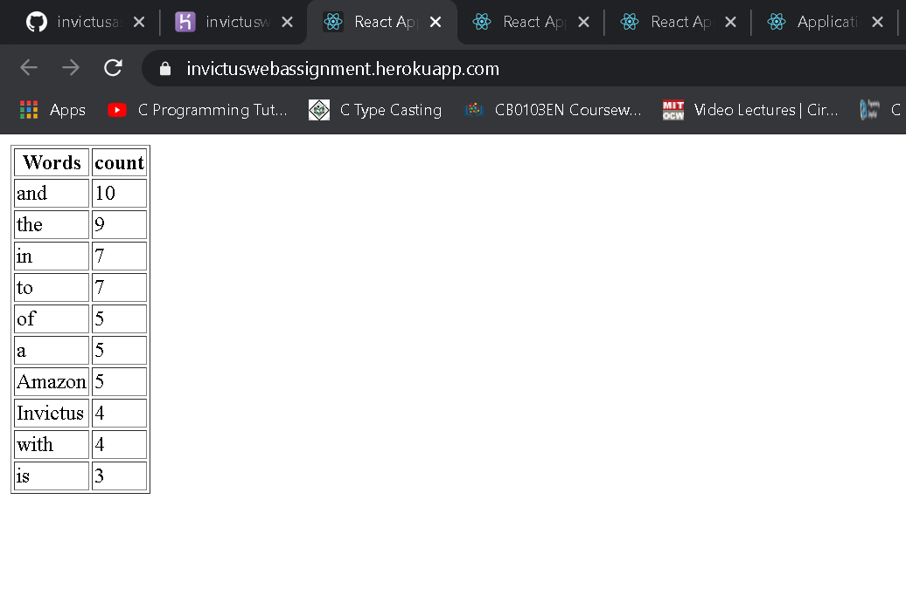

# INVICTUS HIRING ASSIGNMENT
It is a word counter app made using REACT.JS FOR INVICTUS hiring challeng.
It shows N top occuring words and their total count in  https://raw.githubusercontent.com/invictustech/test/main/README.md .

# IT IS DEPLOYED ON heroku platform - https://invictuswebassignment.herokuapp.com/

Inside src folder there is javascript file named index.js which contain the skelton code for this word counter app.

### REACT-DOM PACKAGE
It is a package that provide document object model specific methods which can be used at top level of web app to manage DOM element 
of the web page in efficient manner. To import ReactDOM we write -
#### import ReactDOM from 'react-dom'

## On clicking the Submit button it shows the table which contain the row word and count 

After entering  the value of Nth number and clicking submit button using onclick properties of button a handleClick() function is called.
Inside handleClick() function which fetch the data from given file  using  fetch()  . And then we call findMostFrequent() which return back an array containing 
wor and count in decreasing order and this all data gets rendered to show in table format using render() of React-Dom. 

## EXAMPLE SHOING WHEN VALUE IS ENTERED "0"-:

## EXAMPLE SHOING WHEN VALUE IS ENTERED "5"-:

## EXAMPLE SHOING WHEN VALUE IS ENTERED "10"-:

